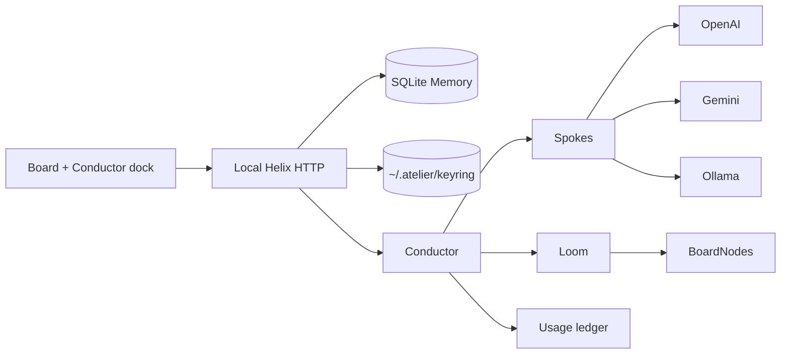

# Helix — original Atelier architecture

Atelier is a local **BYOK design studio**. It is inspired by Lovart’s public product surface (ChatCanvas, thinking vs fast, brand kit, project/thread) but does **not** clone Lovart code, private APIs, or credit billing.

Spend happens on **your** official provider accounts:

- OpenAI → `https://api.openai.com` (`OPENAI_API_KEY` / platform.openai.com)
- Gemini → `https://generativelanguage.googleapis.com` (`GEMINI_API_KEY` / aistudio.google.com)
- Ollama → `http://127.0.0.1:11434` only
- Optional OpenAI-compatible host you set explicitly

Unofficial ChatGPT website / cookie / reverse-proxy clients are rejected.

## Modules

| Module | Job |
|---|---|
| **Keyring** | Local secrets, 0600 file, env override, redacted status |
| **Spokes** | Official-host adapters (`assert_official_host`) |
| **Conductor** | `fast`: brief → route → weave. `thinking`: + score + critique + pin |
| **Board** | Infinite-canvas nodes (image / note), drag persist |
| **Loom** | Image weave + demo SVG so the studio works without keys |
| **Memory** | Projects, threads, messages, artifacts, nodes, usage |

## Why original

Lovart’s MCoT is proprietary. Helix uses a six-phase **cloth** metaphor (brief / score / route / weave / critique / pin) with an explicit JSON plan schema, a hard weave cap (4), and demo fallback so a missing key never blanks the board.

## MVP wired OSS patterns (not vendored)

LiteLLM routing + cost, Open WebUI / LibreChat key UX, Instructor-style JSON plans, Excalidraw/tldraw/fabric board ideas, ComfyUI as a *future* worker, official OpenAI + Gemini HTTP contracts. Full set: `data/top100.json`.

## Next Memory invariants (research)

The live `helix/store.py` stays the small runtime. A fuller single-tenant design — Intent/Matter strands, rungs, append-only messages/usage, board as a disposable projection, write-only keyring — is in `research/fable5/04-helix-arch/` (`ARCHITECTURE.md`, `schema.sql`, `openapi.yaml`).
