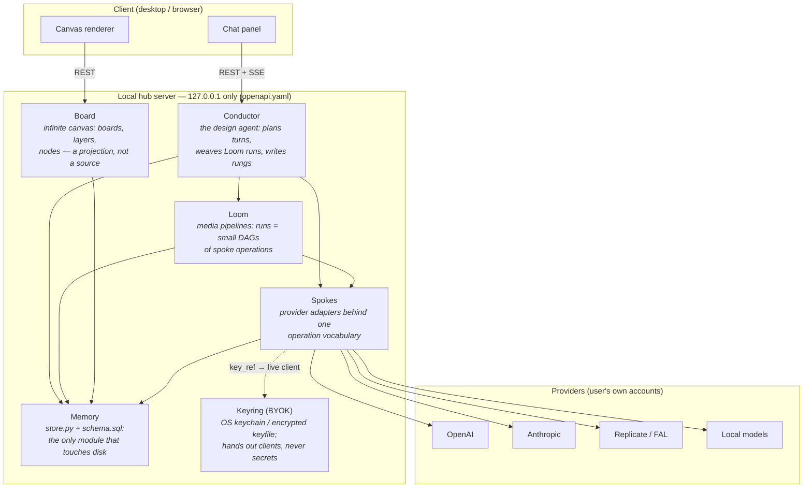
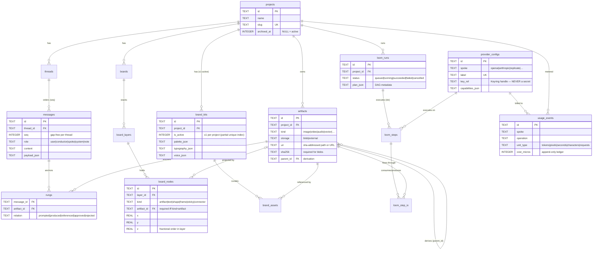
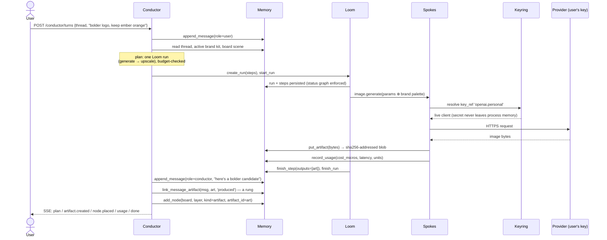
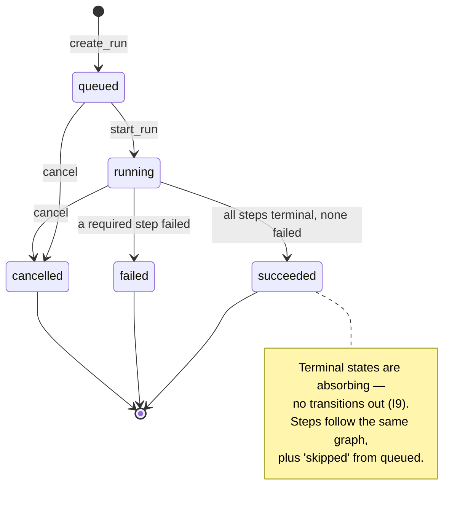

# Atelier — the Helix architecture

Atelier is a **local-first, bring-your-own-key design studio**: an agentic
canvas app in the same product class as Lovart (conversational design agent +
infinite canvas + multi-provider media generation), but designed from first
principles rather than derived from any existing implementation. This document
defines the Helix architecture: six modules around one persistence spine.

**Deliverables in this directory**

| File | What it is |
| --- | --- |
| `ARCHITECTURE.md` | This document: modules, diagrams, invariants, rationale. |
| `schema.sql` | The SQLite schema (single source of truth, loaded verbatim by the store). |
| `openapi.yaml` | REST API of the local hub server (OpenAPI 3.0.3, loopback only). |
| `store.py` | Memory implemented on the Python standard library (`sqlite3`). |
| `test_store.py` | Invariant test suite for `store.py` (`python3 test_store.py`). |

---

## 1. The helix metaphor (and why it earns its name)

Every design session produces two parallel, ever-growing histories:

* the **Intent strand** — what was asked, decided and said
  (*threads* and *messages*), and
* the **Matter strand** — what was actually made
  (*artifacts*: images, video, audio, vectors).

Both strands are **append-only**. They twist around each other over the life
of a project and are held together by **rungs**: provenance links that record
*which message prompted, produced, referenced, approved or rejected which
artifact*. Given any pixel on the canvas you can climb the rungs back to the
sentence that caused it; given any sentence you can find everything it made.

Everything else in the system is either machinery that extends the strands
(Conductor, Loom, Spokes) or a **projection** of them (Board). Projections are
mutable and disposable; the strands are not. That single asymmetry drives most
of the invariants below.

## 2. Module map

### Module contracts

| Module | Owns | Never does |
| --- | --- | --- |
| **Keyring** | Raw secrets, in the OS keychain (or an age/argon2-encrypted keyfile as fallback). Maps `key_ref` handles like `openai.personal` to secrets. Write-only API. | Never returns a secret over the API; never writes a secret to SQLite or logs. |
| **Spokes** | One adapter per provider family behind a shared operation vocabulary (`text.generate`, `image.generate`, `image.upscale`, `image.edit`, `video.generate`, `audio.generate`, `vector.trace`, …). Each call emits exactly one `usage_event`. | Never persists anything except through Memory; never sees a `key_ref`'s value except transiently inside a request. |
| **Conductor** | The agent loop: read thread + active brand kit + board state, plan, execute (directly or by weaving a Loom run), then write messages, artifacts and rungs back. Streams progress over SSE. | Never mutates history; it can only append. Never exceeds the turn's cost constraint (checked against the usage ledger mid-turn). |
| **Board** | Boards, layers, nodes; viewport; paint order (`layer.z_index` then `node.z`, fractional for cheap reordering). | Never owns pixels — an artifact node *references* the matter strand. Deleting nodes/layers/boards never deletes artifacts. |
| **Loom** | Pipeline runs: a run is an ordered list of steps (optionally a DAG via `plan.edges`), each step one spoke operation with recorded artifact inputs/outputs and a strict status graph. | Never invents provenance: every produced artifact is registered before the step finishes. |
| **Memory** | The SQLite database and the content-addressed blob root. All aggregates: projects, threads, messages, artifacts, boards, brand kits, provider configs, usage events, runs. | Never accepts a raw secret (scanned and refused); never hard-deletes projects, messages or usage events. |

## 3. Data model

Artifact **bytes** live outside SQLite in a content-addressed blob root
(`<sha256[:2]>/<sha256>`), written once per hash and never rewritten. SQLite
holds metadata, provenance and annotations. External artifacts (registered by
URL) carry `storage = 'external'` and optional integrity fields.

## 4. A Conductor turn, end to end

## 5. Loom run lifecycle

## 6. Invariants

Each invariant names its enforcement point. "schema" means a constraint,
trigger or index in `schema.sql` that holds even against raw SQL; "store"
means code in `store.py`; "hub" means the API layer.

| # | Invariant | Enforced by |
| --- | --- | --- |
| **I1** | Raw secrets never enter Memory. Provider configs, external URLs and their nested JSON are scanned against key/token/JWT/PEM/userinfo patterns and refused (`SecretLeakError`). | store (`_assert_no_secrets`) |
| **I2** | The database stores only Keyring *handles* (`key_ref`, shape `^[a-z][a-z0-9_.:-]{2,63}$`); the Keyring API is write-only — no endpoint ever returns a secret. | schema (CHECK) + store + hub |
| **I3** | Messages are append-only with a gap-free per-thread `seq`. No UPDATE or DELETE, ever — even via raw SQL. | schema (triggers + UNIQUE) |
| **I4** | Artifact content and provenance (`uri`, `sha256`, `kind`, `mime`, `parent_id`, …) are frozen after insert; only annotations (`title`, `meta`) may change. | schema (trigger) |
| **I5** | A canvas node of `kind = 'artifact'` must reference an artifact. | schema (CHECK) |
| **I6** | At most one active brand kit per project; activation is an atomic swap. | schema (partial unique index) + store |
| **I7** | A board projects only artifacts owned by its own project; lineage and brand assets cannot cross projects either. | store |
| **I8** | `usage_events` is an append-only ledger — the meter never lies. No UPDATE or DELETE. | schema (triggers) |
| **I9** | Loom runs and steps move only along the legal status graph; terminal states are absorbing. | store (`_transition`) |
| **I10** | Blob artifacts are content-addressed: identical bytes are stored once per sha256; artifact *identity* stays distinct from artifact *content*. | store (`_blob_write`) |
| **I11** | Projects, threads, messages and usage events are never hard-deleted; projects archive. Board nodes/layers and brand assets are the disposable exceptions — they are projections/curation, not history. | store (no delete paths) |
| **I12** | The hub binds to 127.0.0.1 only and requires a per-install bearer token; nothing listens on public interfaces. | hub |

## 7. Why this is original, not a Lovart clone

Lovart is the *product reference point* — "conversational design agent on an
infinite canvas" — but Helix is not derived from Lovart's architecture, code,
schema or API, none of which are public. The design decisions below are made
for a different set of constraints and several of them are deliberate
inversions of how a cloud product like Lovart must work:

1. **Local-first, single-tenant.** Lovart is a hosted multi-tenant SaaS; the
   canonical state lives on their servers. Helix's canonical state is one
   SQLite file plus a blob directory on the user's disk. There is no tenant
   column, no cloud sync protocol, no server-side render farm — and a whole
   project is exportable as one JSON snapshot (`helix-snapshot/1`).
2. **BYOK as an architectural boundary, not a billing feature.** Lovart
   meters its own credits on its own provider accounts. Helix has no credits:
   the user brings provider keys, the Keyring quarantines them from the
   database (I1/I2 are *enforced*, with tests), and the usage ledger exists so
   the user can audit their own spend — not so a vendor can bill them.
3. **The helix itself: two append-only strands joined by rungs.** Making
   messages and artifacts immutable ledgers, and provenance (`rungs`,
   `parent_id`, `loom_step_io`) a first-class queryable structure, is a data
   model choice made here for auditability — "every pixel is explainable" —
   not something observable in or copied from Lovart.
4. **Canvas as projection.** In Helix the board is explicitly *not* the
   source of truth: nodes reference immutable artifacts, and deleting a node,
   layer or board destroys no work (I11). A canvas-first tool makes the
   opposite choice; this one falls out of the strand/projection asymmetry.
5. **Provider-agnostic spokes with a flat operation vocabulary.** Adapters
   are commodity plumbing behind `image.generate`-style operations chosen for
   this design; every call lands exactly one row in an append-only meter.
6. **An open, documented loopback API.** `openapi.yaml` is the whole surface;
   any client (CLI, TUI, alternative canvas) can drive the same hub. Lovart's
   interface is its proprietary web app.

What *is* shared with Lovart is the product intuition — a design agent should
converse, plan multi-step media pipelines, respect a brand identity, and put
results on an infinite canvas. Everything below that intuition (module
boundaries, the helix data model, the invariants, the schema, the API, and
every line of `store.py`) is original work, written for this document.

## 8. Failure and privacy posture

* **Crash safety.** SQLite in WAL mode with `IMMEDIATE` transactions; blob
  writes are write-temp-then-`os.replace` (atomic on POSIX), and the blob is
  written before the row that references it, so a crash can strand an orphan
  blob but never a dangling row.
* **Interrupted runs.** Loom statuses are persisted per step; on restart, the
  hub cancels `running` runs older than its boot time (legal under I9) and
  the Conductor offers to re-weave from the last succeeded step's outputs.
* **Budget stops.** The Conductor checks the turn's `constraints.max_cost_micros`
  against the usage ledger between steps and stops cleanly with a `note`
  message rather than overspending.
* **Privacy.** Nothing leaves the machine except spoke calls to providers the
  user configured with their own keys. There is no telemetry. Deleting the
  database file and blob root *is* total erasure.
