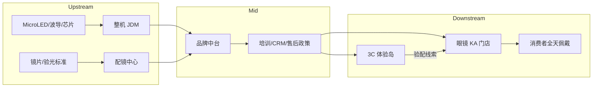

# NIMO 智能眼镜全球操盘计划  
## 暨台湾宝岛眼镜 KA 合作方案

| 项目 | 内容 |
|------|------|
| 文档版本 | V1.0 |
| 编制日期 | 2026-08 |
| 品牌主体 | NIMO（深圳比特幻境 BitFantasy） |
| 产品定位 | 日常可戴近视眼镜 + AI HUD 信息过滤 |
| 核心渠道策略 | **眼镜渠道为主、3C 渠道为辅、双轨协同** |
| 重点 KA | 台湾宝岛眼镜集团（Formosa Optical） |

---

## 一、执行摘要

全球 AI 智能眼镜已进入规模化拐点：2025 年全球出货约 850 万台（同比 +330%），2026 年有望冲向 2,000 万台量级；音频/摄像类产品贡献销量，**带显示（HUD）产品贡献利润**。竞争从「功能堆叠」转向「全天可戴 + 隐私合规 + 验配闭环」。

NIMO 的差异化卡位清晰：

- **29g 钛合金/碳纤维镜架**，形态接近普通近视镜  
- **MicroLED + 体全息波导**，单目高亮 HUD，透光率高  
- **无摄像头、无扬声器**，避开隐私与社交尴尬  
- **原生支持验光配镜**（近视/远视/散光及功能镜片）  
- 中国大陆已验证 **LOHO × NIMO** 眼镜渠道打法（含镜约 ¥2,499）

**操盘主线：** 以眼镜渠道完成「认知—试戴—验配—售后」闭环，以 3C 渠道完成「科技心智—种草—高潜用户获取」；全球分三阶段滚动：大中华样板 → 亚太复制 → 欧美合规深耕。台湾以宝岛眼镜为桥头堡 KA，用「隐私日常眼镜」差异化切入其既有 Rokid 等产品矩阵，避免正面红海价格战。

---

## 二、全球市场洞察（2025–2027）

### 2.1 市场规模与结构

| 维度 | 关键判断 | 对 NIMO 的含义 |
|------|----------|----------------|
| 出货节奏 | 2025≈850 万台；2026 目标区间 1,000–2,200 万台（机构口径不一） | 窗口期 18–24 个月，晚入场成本陡升 |
| 品类结构 | 无显示（音频/摄像）占销量；HUD/AR 显示占价值 | NIMO 走价值带，不拼 Meta 级出货 |
| ASP | 消费级约 $350–400 区间上移 | 含镜包定价宜锚定「换一副日常镜」心理账户 |
| 区域 | 北美份额最大；亚太增速最快；中国供应链最完整 | 制造在中国，品牌运营本地化 |
| 巨头入局 | Meta 高份额；Samsung/Google 2026；Apple 预期 2027 | 避开「摄像社交」赛道，抢「隐私日常」空白 |

### 2.2 需求驱动与阻力

**驱动：** 大模型普及、实时翻译/导航刚需、近视人群基数、线下试戴习惯回潮、企业会议提词场景。  
**阻力：** 续航与发热、应用生态薄、厚重/「设备感」、隐私监管、配镜服务能力不足导致退货。

### 2.3 竞争定位地图

```text
                    高「设备感 / 功能堆叠」
                              │
           Ray-Ban Meta       │      Rokid / 部分国产 HUD
           HTC VIVE Eagle     │
                              │
  低隐私敏感 ─────────────────┼───────────────── 高隐私敏感
                              │
           传统音频眼镜       │      ★ NIMO
                              │   （轻、无摄、验配原生）
                              │
                    低「设备感 / 日常镜形态」
```

**一句话定位：**  
> NIMO 不是「带眼镜形态的数码产品」，而是「恰好具备智能显示的日常近视镜」。

---

## 三、双渠道上中下游市场分析

智能眼镜同时跨越 **消费电子（3C）** 与 **视光零售（眼镜）** 两条价值链。NIMO 必须按两条链分别做供应链、毛利与能力建设。

### 3.1 3C 数码渠道：上—中—下游

#### 上游（核心部件与标准）

| 环节 | 关键要素 | 代表/格局 | NIMO 动作 |
|------|----------|-----------|-----------|
| 微显示光机 | MicroLED 体积、亮度、功耗 | JBD 等领先；成本占比高 | 锁定米粒级光机供应与年度产能 Pref |
| 光波导 | 全息/衍射良率、透光率 | 国内至格、灵犀等量产加速 | 体全息路线绑定，控 98% 级透光体验 |
| 主控/连接 | 低功耗 SoC、BT/Wi‑Fi | 高通 AR 系、恒玄等 | 优先手机协同架构，降低端侧算力成本 |
| 结构/电池 | 钛合金、碳纤维、微型钢壳电池 | 精密结构件集群在华南 | 维持 29g / 5:5 配重作为不可妥协规格 |
| 认证与标准 | CE/FCC/NCC、无线电、SAR | 各国差异大 | 出海前预埋认证包与本地代理 |

**上游洞察：** 光学（光机+波导）约占带显示整机成本 **40%–50%**，芯片约 **20%–30%**。议价权在光学良率与产能，不在组装。

#### 中游（方案整合与制造）

| 角色 | 职责 | 风险 | NIMO 策略 |
|------|------|------|-----------|
| 品牌/ID/光学联合研发 | 定义体验与工业设计 | 规格漂移导致「不像眼镜」 | 设立「日常镜红线委员会」（重量/镜腿粗细/透光） |
| ODM/OEM | SMT、组装、老化、良率 | 小批量良率波动 | JDM 深度定制；月度良率看板 |
| 软件与云 | App、通知过滤引擎、账号 | 生态弱导致复购低 | 聚焦「过滤噪音」单点价值，少而精 |
| 售后维修中心 | 模块更换、镜腿电池 | 3C 渠道期望快修 | 亚太设区域维修仓；镜框/光机分件策略 |

#### 下游（分销与零售）

| 渠道类型 | 典型玩家 | 适合卖什么 | NIMO 打法 |
|----------|----------|------------|-----------|
| 3C 连锁 | Best Buy、YD、Bic Camera、灿坤、顺电 | 科技尝鲜、对比试玩 | 旗舰店体验岛 + 导购脚本；导流至眼镜店验配 |
| 运营商 | Verizon、台湾大哥大、软银等 | 合约捆绑、流量套餐 | 仅做「无度数展示机 + 合约引流」 |
| 电商 DTC | Amazon、官网、天猫/京东 | 标准度数/平光尝鲜包 | 限 SKU；强引导线下验配 |
| 内容种草 | YouTube、小红书、IG、Dcard | 心智占领 | KOL 强调「无摄像头可进会议室」 |

**3C 渠道结论：**  
3C 擅长「种草与科技背书」，不擅长「验光、定制片、调校、售后配镜」。NIMO 在 3C 的 KPI 应是 **体验人次与验配线索**，而非单独追求渠道出货冲量。

---

### 3.2 眼镜渠道：上—中—下游

#### 上游（视光与镜片产业）

| 环节 | 关键要素 | NIMO 动作 |
|------|----------|-----------|
| 镜片基材与镀膜 | 折射率、防蓝光、变色、偏光 | 与蔡司/豪雅/依视路级或区域等价供应商做「智能框专用片」认证 |
| 验光设备与标准 | 综合验光仪、瞳距、顶点距离 | 输出《NIMO 验配 SOP》与公差标准 |
| 镜框模具与饰品感 | 时尚款、镜腿粗细、铰链隐藏光机 | 每季 2–3 款时尚色；与渠道联名款 |
| 视光人才 | 验光师资质、调校能力 | 渠道培训认证体系（NIMO Certified Optician） |

#### 中游（连锁总部能力）

| 能力 | 说明 | 合作要点 |
|------|------|----------|
| 采买与 SKU | 框型、度数段、库存周转 | 采用「展示机 + 区域中心仓配片」降低门店库存 |
| 培训督导 | 卖点、异议处理、体验动线 | 总部 TTT（Train the Trainer）+ 神秘顾客 |
| 会员 CRM | 回购、家庭账户、企业团购 | 与渠道会员积分互通 |
| 售后政策 | 保修、换片、调校 | 明确「电子模组保修」与「镜片质保」双轨 |

#### 下游（门店与消费者场景）

| 触点 | 消费者行为 | 转化关键 |
|------|------------|----------|
| 街边/商场眼镜店 | 换镜周期 1.5–3 年 | 把换镜决策升级为「换智能日常镜」 |
| 百货精品柜 | 品牌与设计溢价 | La Mode / 精品线做形象款 |
| 眼科/视光中心 | 信任与专业 | B2B2C 推荐计划 |
| 企业/校园团购 | 会议提词、留学翻译 | 宝岛企业/校园活动已有基础，可嫁接 |

**眼镜渠道结论：**  
眼镜渠道掌握 **验配权与信任权**，是 NIMO 的「主战场」。中国 LOHO 模式已证明：含镜包价 + 门店一站式，可改写用户心理账户（从「买数码玩具」变为「升级现有眼镜」）。

---

### 3.3 双渠道价值分配与冲突管理

| 议题 | 原则 |
|------|------|
| 价格锚点 | 眼镜渠道含镜包价为官方锚；3C 仅售「镜框主机 + 平光/展示」或导流券 |
| 售后归属 | 电子问题→品牌/3C 维修；度数/佩戴→眼镜门店 |
| 佣金 | 眼镜渠道拿配镜与服务利润；3C 拿硬件零售毛利 + 线索激励 |
| 排他 | 区域 KA 可谈品类 exclusivity（如「隐私无摄 HUD」细分），非全品类排他 |
| 数据 | 门店出货、验配完成率、7/30 日活跃由品牌中台统一看板 |



---

## 四、NIMO 全球操盘计划

### 4.1 战略目标（建议滚动 24 个月）

| 阶段 | 时间 | 地理重心 | 核心目标 |
|------|------|----------|----------|
| Phase 0 样板固化 | M0–M3 | 中国大陆（LOHO 等） | 验配 SOP、退货率、NPS 达标；供应链良率稳定 |
| Phase 1 华人市场桥头堡 | M3–M9 | **台湾**、港澳、新加坡 | 签约 1–2 家眼镜 KA；台湾首年目标见下文 |
| Phase 2 亚太扩张 | M9–M18 | 日韩、东南亚 | 3C 种草 + 当地眼镜连锁；完成关键认证 |
| Phase 3 欧美合规深耕 | M12–M24 | 西欧、北美精选城 | 隐私叙事主打；光学精品店/独立 Optician 网络 |

### 4.2 产品与 SKU 策略

| SKU | 描述 | 渠道 |
|-----|------|------|
| NIMO Core Frame | 主机镜框（多色） | 全渠道 |
| Rx Pack | 含验光 + 定制片（含功能片升级） | 眼镜主渠道 |
| Demo / Plano | 平光体验与电商尝鲜 | 3C / 电商 |
| Enterprise Kit | 提词/翻译企业包 + 批量托管 | B2B |
| Care Plan | 延保、意外换、年度免费调校 | 与 KA 捆绑 |

**定价建议（台湾市场示意，需落地前做汇率与关税校准）：**

- 主机建议零售：约 **NT$12,900–16,900**（对标「中高端钛架 + 智能」而非纯 3C）  
- 含常规单光定制片套餐：约 **NT$16,900–22,900**  
- 功能片（防蓝光/变色等）阶梯加价  
- 对比锚：宝岛在售 Rokid 约 NT$19,999 — NIMO 应以 **更轻、更日常、更隐私** 支撑相近或略低套餐价，而非单纯低价冲击。

### 4.3 全球 GTM：市场优先级

| 优先级 | 市场 | 理由 | 主渠道 | 辅渠道 |
|--------|------|------|--------|--------|
| P0 | 中国大陆 | 供应链与 LOHO 样板 | 眼镜连锁 | 电商 |
| P0 | **台湾** | 近视渗透高、眼镜连锁成熟、已有 AI 眼镜教育 | **宝岛等眼镜 KA** | 灿坤/运营商体验 |
| P1 | 日本 | 精致佩戴文化、百货/眼镜双强 | JINS/Owndays 类 + 药妆 | Bic Camera |
| P1 | 新加坡/马来 | 华人+英语桥头堡、旅游翻译场景 | 区域光学连锁 | 数码卖场 |
| P2 | 韩国 | Gentle Monster 审美高地，竞争烈 | 精品光学 | 电子卖场 |
| P2 | 西欧（德/英/法） | GDPR 与隐私叙事契合 | 独立 Optician 网络 | 精选 3C |
| P3 | 美国 | Meta 心智极强 | 精品光学/独立验光 | Best Buy 限定 |

### 4.4 营销主叙事（全球统一，本地翻译）

**全球 Big Idea：**  
**Filter the noise. Keep your focus.**（过滤噪音，守住专注）

**三条必讲：**

1. **像眼镜，而不像设备** — 29g，全天戴  
2. **无摄无喇叭，会议室也能戴** — 隐私优先  
3. **门店验光配到好** — 不是配件挂片，是你的下一副近视镜  

**禁用叙事：** 过度 VR/元宇宙、偷拍能力、 fort  fort  fort「全面替代手机」。

### 4.5 组织与作战单元（全球）

| 单元 | 职责 |
|------|------|
| 全球品牌与产品 | 规格红线、版本节奏、定价带 |
| 渠道作战室（眼镜） | KA 谈判、培训、验配质量 |
| 渠道作战室（3C） | 体验岛、导流券、数码 PR |
| 供应链与质量 | 光学良率、认证、维修周转 |
| 市场本地化小队 | 每进一国设「国家操盘手 + 视光顾问 + 商务」 |

### 4.6 关键里程碑 KPI

| KPI | Phase 1 目标（示意） |
|-----|----------------------|
| 眼镜渠道签约 KA | ≥2（含台湾宝岛或同等） |
| 认证验配门店 | 台湾首波 30–50 家 |
| 验配完成率（下单后 15 日） | ≥85% |
| 30 日活跃率 | ≥55% |
| 硬件退货率 | ＜5% |
| 门店 NPS | ≥40 |

### 4.7 风险与应对

| 风险 | 应对 |
|------|------|
| 巨头价格战/广告压制 | 坚守细分；不拼摄像头社交 |
| 光学良率波动 | 双供或安全库存；控制首发门店数 |
| 渠道已有竞品排他 | 谈「品类细分 exclusivity」+ 联名款 |
| 隐私与无线电法规 | 无摄是优势；仍需完整 NCC/NCC 等效与 App 合规 |
| KA 内部治理/舆情 | 商务合同主体尽职调查；分阶段铺货 |

---

## 五、台湾市场切入策略（承上启下）

### 5.1 市场机会

- 台湾近视与配镜习惯成熟，消费者接受「到店验配」。  
- 2025–2026 年 AI 眼镜心智已被教育：宝岛 × Rokid、灿坤 × 小林/蔡司、HTC × 台湾大/得恩堂等。  
- **机会不在「再教育品类」，而在「给出不同选择」：** 不想被拍摄、想更轻、想当日常近视镜的用户被现有方案覆盖不足。

### 5.2 竞争格局（台湾）

| 玩家组合 | 通路 | 产品倾向 | NIMO 对策 |
|----------|------|----------|-----------|
| 宝岛 × Rokid | 眼镜主渠道，约 50+ 指定店起 | 带显示 AI，功能全 | **差异化共存**：定位「隐私日常镜」 |
| 灿坤 × 小林 × Zeiss | 3C + 眼镜护眼生态 | 销售+配镜闭环 | 3C 不硬刚；可谈体验联动 |
| HTC VIVE Eagle × 台湾大/光学经销 | 运营商 + 精品光学 | AI 语音/影像 | 避开摄像卖点，打会议/通勤专注 |
| 灿坤自有品牌入门款 | 3C 价格带 | 低价尝鲜 | NIMO 不进价格泥潭 |

### 5.3 台湾渠道配比建议（首年）

| 渠道 | 销售占比目标 | 角色 |
|------|--------------|------|
| 眼镜 KA（宝岛主） | 60%–70% | 成交与验配 |
| 其他光学（大学/得恩堂等精选） | 10%–15% | 补网点与制衡 |
| 3C/运营商体验 | 10%–15% | 种草与线索 |
| 官网/电商 | 5%–10% | 边远与配件 |

---

## 六、台湾宝岛眼镜 KA 合作计划

### 6.1 为什么是宝岛

| 维度 | 宝岛资产 | 对 NIMO 的价值 |
|------|----------|----------------|
| 规模 | 集团门店约 470 家量级；台湾连锁领先 | 快速覆盖与品牌背书 |
| 多品牌矩阵 | 宝岛直营、文雄、镜匠、米兰、La Mode、SOLO MAX 等 | 可分层铺货：大众验配店 + 百货形象店 |
| 会员 | 会员数百万级；APP/LINE 活跃 | 精准触达换镜人群与高消费力客群 |
| 趋势态度 | 已引入 Rokid，证明总部愿意做 AI 眼镜 | 决策门槛降低，但仍需新品类逻辑 |
| 服务能力 | 验光、快配、百货一站式 | 完美匹配 NIMO「配到好」模型 |

**合作主张（对宝岛话术）：**  
> Rokid 服务「尝鲜与全能 AI」客群；NIMO 服务「每天都要戴、在意隐私与舒适」的主力换镜客群。二者不是替代，而是 **扩大 AI 眼镜品类饼**，并提高配镜客单与会员粘性。

### 6.2 合作愿景与 12 个月目标

**愿景：** 把宝岛打造成台湾「隐私优先 AI 日常眼镜」第一渠道。

| 指标 | 12 个月目标（建议谈判起点） |
|------|-----------------------------|
| 上市节奏 | 签约后 10–14 周首卖 |
| 首波门店 | **40 家**（北中南比例约 5:3:2） |
| 第二波 | 再扩至 **80–100 家**（含文雄/百货柜精选） |
| 首年零售 GMV | **NT$1.2–1.8 亿**（含镜套餐口径） |
| 套餐附带配镜率 | ≥75% |
| 门店月均销售（成熟店） | 8–15 副 |
| 培训认证验光师/销售 | ≥200 人 |
| 会员活动触达 | ≥2 次全员推播 + 4 场百货/校园事件 |

### 6.3 合作架构与商务模式

#### 6.3.1 合作主体与模式建议

| 模式 | 说明 | 建议 |
|------|------|------|
| 品牌授权经销 | 宝岛光学科技或指定采购主体为台湾总经销/主 KA | **首选**：主 KA + 有限分销权 |
| 寄售 / 销存 | 降低门店库存压力 | 首波 40 店可采用寄售展示机 + 中心仓 |
| 联名款 | 「Formosa × NIMO」限定色 | Phase 2 推出，强化排他感知 |

#### 6.3.2 商务与毛利框架（示意）

| 项目 | 建议框架 |
|------|----------|
| 供货折扣 | 视量级阶梯：年度 3,000 / 6,000 / 10,000 副台阶返利 |
| 门店毛利 | 硬件零售毛利目标 25%–35%；配镜与功能片毛利归门店传统结构 |
| 市场基金 MDF | 供货额 3%–5%，用于陈列、试戴台、数字广告 |
| 培训基金 | 固定年度预算 + 每新店开业包 |
| 价格管控 | MAP（最低广告价）+ 套餐官方价；禁止裸价倾销主机 |
| 售后 | 品牌负责模组；宝岛负责验配与调校劳务；双方 48h 响应 SLA |

#### 6.3.3 排他与竞品条款

- **可谈：** 在「无摄像头 HUD 日常近视智能眼镜」细分 12–18 个月渠道 exclusivity（台湾）。  
- **不建议强求：** 全品类 AI 眼镜排他（宝岛已有 Rokid）。  
- **保护条款：** 若宝岛引入直接对标「无摄轻量 HUD」竞品，NIMO 有权调整 MDF/返利或增加其他 KA。

### 6.4 铺货与门店分层

| 层级 | 门店类型 | 数量（首波） | 职责 |
|------|----------|--------------|------|
| S | 百货旗舰 / 形象店（微风、新光、梦时代等） | 8–10 | 完整体验区、媒体试戴、联名陈列 |
| A | 都会区高销宝岛直营 | 20–25 | 主力成交与验配 |
| B | 文雄/镜匠等矩阵店精选 | 8–10 | 覆盖更多商圈与价格带客群 |
| Hub | 北中南配片/售后中心 | 3 | 集中车房对接与维修中转 |

**陈列标准：**  
独立「Focus Bar」体验台（非塞进普通镜架墙）；必须有：试戴镜 ×3 色、手机投屏演示脚本、隐私卖点立牌、验配预约二维码。

### 6.5 门店销售动线（SOP）

1. **吸引（30 秒）：** 「这是一副可以全天戴的近视镜，不是会拍你的数码眼镜。」  
2. **体验（3 分钟）：** 抬头唤醒 HUD → 导航/翻译/消息过滤三选一演示。  
3. **消顾虑：** 无摄像头、重量对比、会议室可用。  
4. **验光成交：** 走现有验配流程；推荐套餐而非裸框。  
5. **激活：** App 配对、通知白名单设置、7 日内回店微调。  
6. **转介：** 企业客户登记；家庭第二副优惠。

### 6.6 培训与认证体系

| 课程 | 对象 | 时长 | 考核 |
|------|------|------|------|
| NIMO Product 101 | 全员销售 | 2h | 笔试 |
| 验配与调校认证 | 验光师 | 4h + 实操 | 实操认证牌 |
| 竞品对照话术 | 店长 | 1.5h | 情景演练 |
| 售后与客诉 | 店长/客服 | 1h | SLA 测验 |

认证门店可使用「NIMO Certified」门贴；未认证店不得售卖 Rx Pack。

### 6.7 联合营销日历（首发 90 天）

| 时间 | 动作 |
|------|------|
| T-45 | 总部签约 PR；内部动员会；种子店装修建置 |
| T-30 | KOL/医美或商务意见领袖试戴（强调隐私）；员工内购 |
| T-14 | 会员 APP/LINE 预热；百货橱窗 |
| T-0 | 首卖日：台北 S 级店媒体场 + 限量联名镜布 |
| T+7 | 复盘转化率；优化话术 |
| T+30 | 校园/科技园区快闪「专注工位」 |
| T+60 | 企业团购通道开启（会议提词包） |
| T+90 | 第二波扩店决策；评估文雄/La Mode 形象款 |

**媒体要点：** 繁中内容主权；对比沟通用「品类内差异」而非贬低宝岛在售其他品牌。

### 6.8 运营治理：联合作战室

| 角色 | 宝岛 | NIMO |
|------|------|------|
| 商务负责人 | 采购/商品部 | 台湾 GM / KA Director |
| 视光质量 | 验光督导 | 临床视光顾问 |
| 零售运营 | 营运督导 | 驻店教练（首季） |
| 市场 | 品牌/数位行销 | 市场经理 |
| 数据 | 提供周销售 | 提供激活与留存 |

**例会节奏：** 周销售会、月经营会、季战略会。  
**看板指标：** 试戴→下单转化、配镜完成时效、激活率、客诉、断货率。

### 6.9 风险专项（台湾 KA）

| 风险 | 缓解 |
|------|------|
| 与 Rokid 货架冲突 | 分区陈列 + 客群分流话术 + 销售激励分品牌核算 |
| 门店学习成本 | 首波控制 40 店；驻店教练轮训 |
| 配片时效 | 台湾本地车房合作或区域中心仓；承诺明确交期 |
| 公司治理/舆情波及 | 合同主体、付款路径、授权链尽职调查；公关口径预案 |
| 灰色进口扰乱价格 | MAP + 序列号渠道绑店 + 保修仅限正规通路 |

### 6.10 谈判路径与决策清单（对内）

**给宝岛的「不可退让」：** 验配 SOP 执行权、MAP、隐私卖点一致性、数据周报。  
**可交换：** 首年排他细分范围、MDF 比例、联名款权益、员工内购力度。  

**签约前检查清单：**

- [ ] 合作主体与商标/供货授权链清晰  
- [ ] 首波门店清单与改造预算确认  
- [ ] NCC 及其他上市合规完成  
- [ ] 繁中 App 与客服（LINE）就绪  
- [ ] 配片 SLA 与售后 SLA 盖章  
- [ ] 销售激励不扭曲导购（禁止只推高返利竞品的冲突条款）

---

## 七、90 天行动路线图（全球 × 台湾并行）

| 周次 | 全球 | 台湾宝岛 |
|------|------|----------|
| W1–2 | 供应链产能与认证缺口盘点 | 高层拜会；品类共存提案 |
| W3–4 | 全球定价带与品牌手册定稿 | 商务条款谈判；门店分层抽样 |
| W5–6 | 亚太 3C 体验规范 | 培训教材/体验台设计签样 |
| W7–8 | 港澳/新加坡意向 KA 接触 | 合同与首单 PO；媒体名单 |
| W9–10 | 日本市场法规预研 | 种子店装修改造；员工内购 |
| W11–12 | Phase1 发布会（大中华） | **台湾首卖**；周会盯转化 |

---

## 八、预算框架（台湾首年示意）

| 科目 | 占首年台湾收入建议 |
|------|--------------------|
| 渠道返利与折扣 | 8%–12% |
| MDF/陈列/试戴资产 | 4%–6% |
| 培训与驻店教练 | 2%–3% |
| 媒体与 KOL | 5%–8% |
| 售后备件与物流 | 2%–3% |
| 本地团队 OPEX | 按编制另列 |

---

## 九、结论与决策建议

1. **全球操盘抓手是「眼镜渠道闭环」**，3C 只负责心智与线索，不可本末倒置。  
2. **产品叙事统一为「隐私、轻量、日常近视镜」**，在 Meta/Rokid/运营商摄像产品之外开辟第二曲线。  
3. **台湾是华人市场最佳桥头堡**；宝岛是最优主 KA，但必须设计与 Rokid **共存的品类角色**，而非硬替换。  
4. **首波宜小而美（约 40 店）**，用验配完成率与 NPS 换取第二波扩店与联名权。  
5. **立即启动：** 宝岛高层提案、NCC/合规、繁中体验与配片 SLA 三条并行。

---

## 附录 A：NIMO 产品能力摘要（对外口径）

- 重量约 29g；钛合金 + 碳纤维；前后配重平衡  
- MicroLED + 体全息波导；高入眼亮度；高透光  
- 无摄像头、无扬声器；触控 + 抬头唤醒  
- 核心场景：翻译、导航提示、消息过滤、会议提词  
- 支持近视/远视/散光等验配；可配功能镜片  
- 续航以官方典型场景口径对外（门店话术统一）

## 附录 B：宝岛集团触点地图（合作时更新）

- 宝岛直营、策略联盟/相关体系、文雄、镜匠、米兰、La Mode、SOLO MAX  
- 会员：APP、LINE、百货柜、企业/校园活动  
- 已有 AI 眼镜经验：Rokid Glasses 指定门市销售与验配  

## 附录 C：文档维护

| 版本 | 日期 | 说明 |
|------|------|------|
| V1.0 | 2026-08 | 首版：全球操盘 + 宝岛 KA |

---

*本文件为市场与渠道战略建议稿，具体商务数字需在尽职调查、成本核算与对方报价后修订。*
