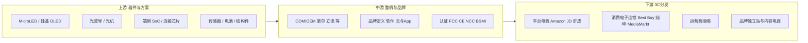
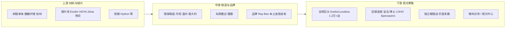

# NIMO 智能眼镜：全球市场洞察与双渠道上中下游分析

> 数据截止 2026 年 8 月公开信息。出货量口径在机构之间存在差异（Omdia / SAG / IDC / Counterpoint），本文并列引用并给出操盘可用的「工作假设」，不把任何单一机构数字当作内部预算。

---

## 1. 结论先行

1. **品类拐点已过，格局尚未定。** 2025 年全球 AI 眼镜出货约 **850–870 万台**（Omdia 870 万、SAG 850 万），同比约 **3.2–3.3 倍**。2026 年机构预测区间 **1,500–2,200 万台**。Meta 仍占全球约 **82–85%**，但份额正在被中国显示类品牌、三星/谷歌入场、以及光学渠道新玩家稀释。
2. **真正的结构性机会不在「音频拍摄镜」红海，而在「可日戴的显示镜」。** 2025 年带显示的 AI 眼镜仅 **73 万台、占比 8.4%**，其中中国品牌约占 **71%**。SAG 判断 HUD 显示类将在 **2028 年后反超音频类并贡献主要收入**。NIMO 正好卡在这条尚未被 Meta 用 Ray-Ban 品牌完全占领的赛道。
3. **渠道才是胜负手。** Meta 用 EssilorLuxottica 的品牌 + Sunglass Hut / LensCrafters 网络证明了「眼镜店卖智能眼镜」可行；Even Realities 用全球 400+ 高端独立眼镜店证明了「无摄像头 HUD」可以在光学渠道卖出 $600+ 客单。NIMO 的差异化是：**把处方验配做成标配、把价格打进中高端配镜带（人民币 2,499 含近视镜）、把外观做成普通眼镜。**
4. **3C 与眼镜是两条价值链，不是两个货架。** 3C 卖「设备与参数」，眼镜卖「验配、信任与复购」。NIMO 若按 3C 逻辑铺货，会被 Meta / 小米 / Rokid 的品牌与促销碾压；若按眼镜逻辑铺货，可以吃到全球每年约 **21 亿片镜片、18 亿副镜架** 的替换周期，以及台湾这种近视高发市场的刚需配镜流量。
5. **台湾是全球操盘的「光学渠道样板市场」。** 近视率全球前列、连锁眼镜集中度适中、宝岛集团约 **470 家门店 / 约 400 万会员**、且宝岛已于 2025 年 12 月引入 Rokid（51 店、售价 NT$19,999）。NIMO 不应要求宝岛「换掉 Rokid」，而应成为宝岛货盘里的 **日戴处方 HUD 专属层**。

---

## 2. 全球市场洞察

### 2.1 规模与增速（工作假设）

| 指标 | 2024 | 2025 | 2026E | 来源与备注 |
| --- | --- | --- | --- | --- |
| 全球 AI 眼镜出货 | ~200 万台量级 | 850–870 万台 | 1,500–2,200 万台 | Omdia / SAG；IDC 另给 2026 年 2,369 万台（口径更宽） |
| 其中带显示（HUD/AR） | 约 3.3% | 73 万台 / 8.4% | 加速，但仍是少数派 | Omdia |
| 批发口径收入 | — | 约 12–20 亿美元量级 | 56–60 亿美元量级 | SAG（机构间口径差大，仅作量级） |
| Meta 份额 | 极高 | 82–85% | 仍第一，但被分流 | Omdia / Counterpoint |
| 中美合计需求 | — | — | 约 80% | SAG |
| 中国零售量 | — | 145 万台（+211%） | IDC 预测约 490 万台 | 洛图 / IDC |
| 2030 出货展望 | — | — | 约 7,500 万台、收入约 290 亿美元 | SAG，CAGR ~89%（高弹性，不作承诺） |

**操盘含义：** 2026–2027 是「进场窗口」而不是「收割窗口」。NIMO 的目标不是挑战 Meta 的音频拍摄镜销量，而是在 **显示类日戴镜** 里成为「光学渠道第一品牌」。

### 2.2 品类三分法（NIMO 必须选边）

| 品类 | 代表 | 用户买的是什么 | 主渠道 | 2026 格局 | NIMO 态度 |
| --- | --- | --- | --- | --- | --- |
| A. 音频/拍摄 AI 镜 | Ray-Ban Meta、Oakley Meta、小米拍摄镜 | 时尚配件 + 第一视角 + 语音助手 | 3C + 太阳镜连锁 + 品牌店 | 量最大、Meta 锁定 | **不正面竞争** |
| B. 全功能显示 AI 镜 | Rokid Glasses、部分国内 AR 品牌 | 「把手机戴在脸上」 | 3C + 部分眼镜店体验 | 中国线上爆发，海外仍贵 | **区隔共存** |
| C. 日戴 HUD / 信息提示镜 | Even G1/G2、NIMO | 下一副日常眼镜 + 静默信息层 | **眼镜店验配为主** | 量小、客单与复购潜力大 | **主战场** |

NIMO 产品事实（公开信息）：

- 整机约 **29g**，β-钛镜腿，5:5 分散配重
- **无摄像头、无扬声器**（隐私与社交可接受度）
- 0.03cc 微型光机 + 体全息波导，单目单绿，仅佩戴者可见
- 典型续航约 **48 小时**
- 处方：近视最高 800 度、远视 200 度、支持散光；可配防蓝光 / 变色 / 偏光
- 中国大陆上市价 **人民币 2,499 含近视镜**（2026 年 4 月）
- 公司：深圳比特幻境（BitFantasy），2025 年 4 月成立；股东含祥峰、九合、**LOHO**；团队来自华为 / Meta / 腾讯等

这一定位与 Even Realities 同族，但价格带完全不同：Even G2 眼镜本体约 **USD 599**，处方另计约 USD 200，全套常超过 USD 800；台湾 Even G2 建议售价 **NT$19,990**。NIMO 是「中产配镜可替换价」，Even 是「海外高端尝鲜价」。

### 2.3 需求侧：谁会为「日戴 HUD」付钱

| 人群 | 场景 | 为什么选 NIMO 而不是 Meta/Rokid | 优先市场 |
| --- | --- | --- | --- |
| 都市通勤白领 | 导航、消息过滤、会议提词 | 要全天戴、不能像数码产品、会议室不能有摄像头 | 中、台、日、韩、新 |
| 高度近视成年 | 本就要换镜 | 2499 含镜片，决策从「要不要买智能硬件」变成「要不要让下一副眼镜更聪明」 | 东亚 |
| 商务跨境人士 | 翻译字幕、提词 | 静默视觉、不影响对方 | 港台、新、迪拜、欧美商旅 |
| 隐私敏感职业 | 金融、政府、教育、医疗、律所 | 无摄无喇叭是准入条件，不是卖点点缀 | 全球合规市场 |
| 极客/Early Adopter | 尝鲜 HUD | 不是基本盘，但是内容和口碑引擎 | 一线城市 3C 与独立站 |

**东亚近视红利：** 台湾、韩国、新加坡、中国沿海城市的成年近视率显著高于欧美。智能眼镜在这些市场首先是「视力矫正商品」，其次才是电子产品。这是 NIMO 相对 Meta 的结构性优势——Ray-Ban Meta 的主货盘仍偏太阳镜与时尚框，处方深度不如光学连锁。

### 2.4 竞争地图（2026）

```
价格 ↑
USD 600+     Even G2 -------------------- 高端独立眼镜店 / 独立站
             Meta Ray-Ban Display
NT$20k / ¥5k+  Rokid Glasses / 部分 AR
             XREAL / 雷鸟（偏观影与AR）
¥2,499       ★ NIMO（含处方）--------- 大众光学连锁 + 官方 DTC
¥1,000–2,000 音频镜白牌 / 部分拍摄镜
价格 ↓
             3C 数码 ←------------------→ 光学验配
```

关键对标：

| 维度 | Meta Ray-Ban | Rokid Glasses | Even G2 | **NIMO** |
| --- | --- | --- | --- | --- |
| 形态 | 时尚太阳/光学框 | 明显的智能设备 | 接近普通眼镜 | **接近普通近视镜** |
| 摄像头 | 有 | 有 | 无 | **无** |
| 显示 | 少数 Display 款 | 光波导 | MicroLED 波导 | 体全息波导 |
| 重量 | 更重 | 更重 | ~36g | **~29g** |
| 渠道 | 雷朋店 + Best Buy + 电商 | 3C + 部分眼镜店 | 400+ 高端眼镜店 | **光学连锁为主（LOHO 基因）** |
| 处方 | 有，但非第一决策 | 可配，体验门槛高 | 光学店独占处方 | **含镜片、按配镜流程卖** |
| 价格带 | 中高 | 高（台湾约 2 万台币） | 高 | **中（配镜可替换）** |

---

## 3. 3C 数码渠道：上中下游

### 3.1 价值链全景



### 3.2 上游：NIMO 的成本与供应卡点

| 模块 | 产业事实 | 对 NIMO 的含义 |
| --- | --- | --- |
| 微显示 | MicroLED 仍贵、良率爬坡中；2.5μm 级是差异化 | 锁核心供应商双源，把 0.03cc 光机当「不可外溢的模具资产」 |
| 波导 | 衍射波导主流，体全息效率更高但产能更窄 | 体全息是卖点也是产能瓶颈，全球铺货必须按波导月产能倒排 |
| SoC / 连接 | 高通等方案功耗与供货周期决定续航与认证 | 无喇叭无摄像头可降低 BOM 与认证复杂度，这是成本武器 |
| 电池 | 镜腿钢壳微型电池，安全测试（针刺/跌落/高温）是准入 | 航空运输、各国电池法规、售后更换政策必须前置 |
| 结构件 | β-钛、碳纤维、铰链藏光机 | 外观「像普通眼镜」依赖眼镜供应链，而不是消费电子外壳厂 |

**3C 上游逻辑：** 谁控制光机与显示，谁就有定价权。NIMO 自研微型光机，本质是把毛利从「买公版光机做整机」上收到「器件 + 整机」。全球操盘时，ODM 只应承担组装与部分结构，**光机、波导、固件不得以交钥匙方式外包给会做自有品牌的代工厂**。

### 3.3 中游：品牌、认证、内容

3C 中游比的是：

1. **认证速度：** FCC / CE / UKCA / NCC / BSMI / PSE / KC / SIRIM / IMDA。无摄像头可减少部分隐私与航空限制，但不能省略射频与电池。
2. **App 与本地模型：** 翻译、导航、通知过滤必须在当地手机生态里好用（iOS/Android、地图、IM）。
3. **内容与评测：** 3C 渠道的转化高度依赖 YouTube / B 站 / 巴哈 / Mobile01 评测。NIMO 的评测脚本应强调「戴一整天、像普通眼镜、会议室能进」，而不是跑分。

### 3.4 下游：3C 分发怎么用、怎么限制

| 渠道类型 | 全球代表 | 适合卖什么 | NIMO 原则 |
| --- | --- | --- | --- |
| 平台电商 | Amazon、JD、Shopee、momo | 标准 SKU、配件、晒单 | 官方店为主，严控串货；处方镜不在纯电商完成 |
| 消费电子连锁 | Best Buy、MediaMarkt、Bic Camera、灿坤、全国电子 | 体验、对比、节日促销 | **只售平光/演示款 + 导流到眼镜店配处方** |
| 运营商 | AT&T、台湾大哥大、NTT Docomo | 套餐捆绑、分期 | 可做平光尝鲜包，处方仍回光学 |
| 内容电商 | TikTok / YouTube Shop | 爆发量、退货也爆发 | 仅限配件与官方兑换券，不做处方履约 |
| 品牌独立站 | bitfantasy / nimo | 高毛利、数据、早鸟 | 全球品牌锚点，本地支付与退换货合规 |

**Meta 已经证明 3C 体验的必要性：** 2026 年 Meta 在 Best Buy 铺设 50+ 家约 84㎡ 的 Meta Lab，因为超过一半顾客表示「不试戴不买」。NIMO 体量做不起 84㎡ 店中店，但必须在 3C 留「试戴桩」，把成交闭环放到光学店。

**Even 已经证明渠道隔离的必要性：** 处方镜片只在有验光资质的光学渠道销售，消费电子店只卖平光。这是 NIMO 全球渠道宪法，台湾宝岛方案必须写进合同。

### 3.5 3C 渠道的利润与冲突

| 问题 | 表现 | 对策 |
| --- | --- | --- |
| 价格透明 | Amazon / momo 比价打死眼镜店毛利 | 3C 与光学 **SKU 隔离**（平光 vs 处方包）；光学店专属镜片与服务费 |
| 退货率 | 3C 14–30 天无理由退货，眼镜定制不可退 | 处方订单适用光学行业「定制商品例外」 |
| 店员激励 | 3C 店员推高客单数码，不推需要讲解的新品 | 按体验人次 + 导流核销计奖，而不是只按 3C 开单 |
| 品牌稀释 | 与拍摄镜、游戏 AR 镜陈列在一起 | 独立「日常眼镜」桌，不进电竞/VR 区 |

---

## 4. 眼镜渠道：上中下游

### 4.1 价值链全景



全球传统眼镜产业量级（公开整理）：2025 年镜片产量约 **21 亿片**（中国约 48%），镜架约 **18 亿副**（中国约 61%）。下游高附加值被 EssilorLuxottica、Kering Eyewear 等掌握；EssilorLuxottica 2025 年营收约 **287 亿欧元**，零售网络逾万家（LensCrafters、Sunglass Hut 等）。

**启示：** Meta 选 EssilorLuxottica，不是因为对方会做 AI，而是因为对方同时拥有 **Ray-Ban 文化符号 + 全球光学零售 + 处方车房**。NIMO 没有雷朋，就必须用「更像眼镜、更好配、更便宜」换取区域连锁的排他档期。

### 4.2 上游：NIMO 必须嵌入的眼镜供应链

| 环节 | 传统眼镜 | NIMO 增量 | 合作要点 |
| --- | --- | --- | --- |
| 镜片坯与功能片 | 防蓝光、变色、偏光、离焦 | 波导片与屈光片的光学匹配 | 指定 1–2 家车房做「NIMO 认证片」；瞳距/顶点距/前倾角写入 SOP |
| 镜架 | 时尚 SKU 极多 | SKU 必须少，保证光机铰链公差 | 全球先 2–3 个框型，亚洲头型优先 |
| 隐眼 | 金可/海昌等 | 不是主业，但是宝岛集团的利润池 | KA 谈判可谈「会员+隐眼」联合活动，不进隐眼供应链 |
| 设备 | 验光仪、焦度计、瞳距仪 | HUD 试戴校准、亮度与对位 | 给门店「5 分钟校准工装」，而不是再买一台贵重设备 |

### 4.3 中游：为什么眼镜店过去不爱卖智能眼镜

公开渠道调研的核心矛盾（综合 36 氪等对门店经济的转述）：

- 传统眼镜：门店单副毛利常见 **人民币 300–500**
- 智能眼镜：门店毛利常见 **人民币 50–200**，还要讲解、调试、售后

所以不是「眼镜店不懂科技」，而是 **「赚得少、做得重」**。NIMO 全球眼镜渠道能否打穿，取决于能否把单副门店经济做成：

> **服务毛利 ≥ 一副中端配镜，工时 ≤ 15 分钟标准验配 + 5 分钟 HUD 校准。**

建议门店经济模型（人民币，含基础处方片）：

| 项目 | 对消费者 | 门店所得（示意） |
| --- | --- | --- |
| NIMO 主机结算 | 含在 2,499 或当地等价套餐 | 主机返利 15–22% |
| 基础处方片 | 已含或小幅升级 | 片差毛利 150–400 |
| 功能片升级（变色/偏光） | +300–1,200 | 传统片毛利，门店熟悉 |
| HUD 校准与会员建档 | 服务包 | 80–150 服务费或计入返利 |
| **门店合计毛利目标** | — | **人民币 500–900 / 副** |

低于这个带，KA 只会把 NIMO 当橱窗道具。

### 4.4 下游：全球光学零售怎么打

| 层级 | 代表 | 打法 | 优先级 |
| --- | --- | --- | --- |
| 全球垂直整合巨头 | EssilorLuxottica | 不碰其独家科技合作（Meta/Google） | 观察，不作为 18 个月主战场 |
| 区域连锁 KA | 中国 LOHO / 宝岛大陆体系、台湾宝岛、博士、日本 JINS/OWNDAYS、韩连锁、新马 Optical 88 | **主战场：总部项目制 + 旗舰试点 + 验配 SOP** | P0 |
| 独立高端店 | 欧美独立 optician、Even 已覆盖的 400 店 | 可选择性点状进入，避免与 Even 正面对撞同店 | P2 |
| 眼科/视光中心 | 宝岛眼科、蔡司视光中心 | 做「视力健康 + 日戴智能」故事，不走 3C 促销 | P1（台湾） |
| DTC | 官网 | 教育、预约到店、配件 | 始终在线 |

**中国存量：** 眼镜零售门店逾 10 万家，连锁化率低，宝岛、博士等头部市占按店数仍低。这意味着全国铺开极贵，必须 **先锁 2–3 个连锁 KA + 直营体验店**，用标准化复制，而不是地推一万家杂店。

LOHO：约 150 城、近 1,000 家店，且为比特幻境发起股东之一——这是中国区「根据地」，但 **不能把 LOHO 模式原样复制到台湾宝岛**（股权关系、竞品货盘、法规都不同）。

---

## 5. 双渠道冲突管理（全球宪法）

1. **SKU 宪法：** 光学店 = 处方套装（主机+认证片+校准+质保）；3C = 平光体验款 / 太阳夹片 / 配件 / 「到店配镜券」。
2. **价格宪法：** 3C 公开价不得低于光学店「主机+基础片」打包价；光学店可卖服务与升级片，3C 不可。
3. **售后宪法：** 电子故障走品牌授权维修；度数不准、装配问题走光学店车房。消费者只面对一个微信/LINE 入口，背后分流。
4. **数据宪法：** 验光数据属门店与消费者，品牌只拿校准参数与激活数据；不做「把宝岛会员导走」的事。
5. **品类宪法：** 不要求 KA 清掉 Rokid / Meta；要求 **「无摄像头日戴 HUD」品类独家**（12–24 个月）。

---

## 6. 对全球操盘的直接推论

| 推论 | 动作 |
| --- | --- |
| 显示类仍是蓝海 | 所有传播只讲「日戴、隐私、处方」，不讲摄像头参数 |
| Meta 锁死 3C 与时尚太阳镜 | NIMO 把预算投向验光师培训和旗舰光学店，而不是拼 Best Buy 面积 |
| 眼镜店要的是毛利与简单 SOP | 把 2,499 含片做成「对门店比对消费者更友好」的结算 |
| 台湾法规强化持证验光 | 谁先帮连锁把智能镜验配流程合法化，谁就是默认供应商 |
| Even 占欧美高价独立店 | NIMO 走东亚大众连锁，再以价格带进入东南亚与中东 |

下一份文档给出 18 个月全球操盘节奏、区域优先级与组织 KPI。
