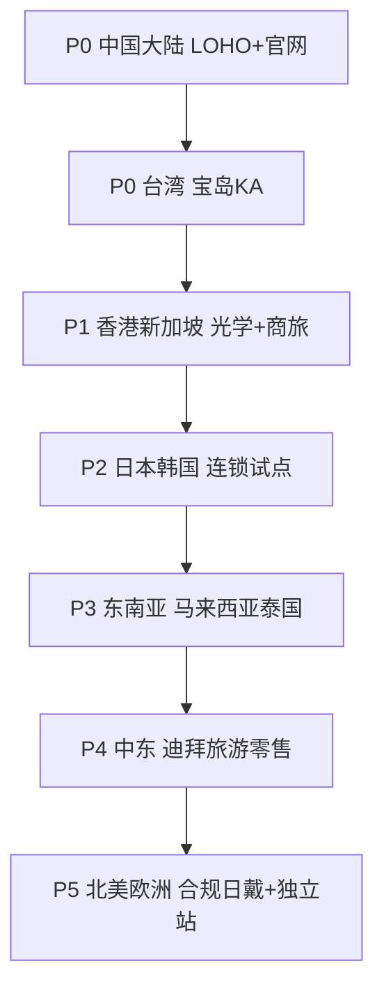

# NIMO 智能眼镜全球操盘计划（18 个月）

> 时间窗：2026 Q3 – 2028 Q1。目标不是「全球铺货」，而是 **在显示类日戴镜赛道建立可复制的光学渠道操作系统**，并用台湾宝岛验证「区域 KA 操盘模型」。

---

## 0. 操盘一句话与三年北极星

**一句话：** 用「普通眼镜的购买路径」卖「静默 HUD」，先东亚光学连锁，再英语世界的合规日戴场景。

| 北极星 | 18 个月（至 2028 Q1） | 说明 |
| --- | --- | --- |
| 全球激活量 | 8–12 万台 | 保守，受波导产能约束 |
| 其中光学渠道占比 | ≥ 70% | 低于此即战略走偏 |
| 日活佩戴（戴出家门） | D30 ≥ 45% | 日戴品类的生命线 |
| 光学 KA 标杆 | 中国 LOHO + 台湾宝岛 + 1 个东南亚连锁 | 可对外讲的样板 |
| 品牌心智 | 「能全天戴的智能眼镜」 | 对标 Even 的 Quiet Tech，但价格带下沉 |

情景（仅供内部对齐，非正式业绩承诺）：

| 情景 | 18 个月出货 | 假设 |
| --- | --- | --- |
| 保守 | 5 万 | 产能/认证延误，仅中台 + 官网 |
| 基准 | 10 万 | 中台光学放量，东南亚试点，3C 只做导流 |
| 乐观 | 18 万 | 日韩各签 1 个连锁，中东旅游零售启动 |

---

## 1. 品牌与产品操盘

### 1.1 全球定位

| 项目 | 定义 |
| --- | --- |
| 品类名 | Daily HUD Glasses / 日戴信息眼镜（对内）；对外不说 AR |
| 品牌承诺 | 先是一副好眼镜，智能只在需要时出现 |
| 禁止语 | 替代手机、拍摄、直播、电竞、元宇宙 |
| 允许语 | 导航、翻译、提词、消息过滤、隐私、全天佩戴、专业验配 |
| 视觉 | 镜框特写 + 真人通勤/会议，禁止赛博脸和霓虹 UI 大图 |

### 1.2 全球 SKU 树（严格控制）

上市 18 个月内不超过 **3 框 × 2 尺寸 × 处方包/平光包**：

| SKU | 渠道 | 目的 |
| --- | --- | --- |
| NIMO Rx Pack | 光学 KA / 认证眼镜店 | 主机 + 基础折射率片 + 校准 + 12 个月质保 |
| NIMO Plano Demo | 3C 体验、企业试用、媒体 | 不可作为处方履约 |
| Clip-on 太阳夹片 | 全渠道 | 提高日戴场景覆盖、提升客单 |
| 认证升级片 | 仅光学 | 变色 / 偏光 / 高折射率 / 防蓝光 |

框型：亚洲头型半框 1、全框 1；欧美头型全框 1（第二阶段）。颜色先黑/透/玳瑁三色，避免时尚镜架逻辑把供应链拖死。

### 1.3 价格带（出厂建议，落地以当地税与认证为准）

| 市场 | Rx Pack 建议零售 | 逻辑 |
| --- | --- | --- |
| 中国大陆 | RMB 2,499 含基础片 | 已上市锚点；用足数码国补（若仍适用） |
| 台湾 | NT$12,980–14,980 含基础片 | 对标中高端配镜，显著低于 Rokid/Even 的 ~2 万 |
| 香港/新加坡 | HKD 2,980 / SGD 499 量级 | 城市溢价，仍低于 Even |
| 日本 | JPY 49,800 量级 | 需落在 JINS 客单可比较区间 |
| 欧美 | USD 349–399 Rx 另计或 USD 449 含基础片 | 不与 Even $599 抢同一货架，打「可负担日戴」 |

**原则：** 全球品牌价差控制在合理关税/税负内，防止台湾/香港成为水货枢纽。

### 1.4 软件与本地化（比硬件更决定复购）

P0（上市必有）：iOS/Android App、通知白名单、导航（当地主流地图）、中英日韩翻译、提词器、固件 OTA、隐私开关默认关闭云上传。

P1（6 个月内）：繁体中文完整本地化（台湾用词、LINE 通知）、日文、韩文；企业 MDM 关闭摄像头类权限声明（本就无摄，但要出合规白皮书）。

P2：开放有限 SDK（导航/提词），不做应用商店幻想。

---

## 2. 区域优先级（先深后宽）

| 阶段 | 市场 | 为什么现在 | 主渠道 | 不做什么 |
| --- | --- | --- | --- | --- |
| 0–6 月 | 中国 + 台湾 | 产能近、近视红利、股东/KA 可谈、竞品已教育市场 | 光学连锁 | 不铺美国 Best Buy |
| 6–12 月 | 港、新、马 | 繁体/英文双语、转口与商旅、验证海外认证 | 光学 + 少量 3C 体验 | 不进杂牌分销 |
| 12–18 月 | 日、韩 | 配镜文化强、客单高、可学 JINS 快时尚逻辑 | 1 家连锁试点 | 不全面铺 Bic Camera |
| 观察 | 欧美 | Even 已占高端独立店；Meta 占 3C | 独立站 + 隐私敏感垂直 | 不烧钱进 Sunglass Hut |

**台湾被放在与中国大陆同级 P0，** 因为：它是「非大陆、华文、持证验光、连锁 KA、竞品已在架」的完整压力测试。打赢宝岛，才有资格复制到 JINS / Optical 88。

---

## 3. 渠道操盘：光学为主、3C 为辅

### 3.1 光学渠道操作系统（全球标准模块）

每一家 KA 只复制这 7 个模块：

1. **选店：** 旗舰 / 商圈 / 科技园店，不要一上来全量铺
2. **陈列：** 1.2–1.8m 日戴桌，真人头模 + 试戴 6 副 + 30 秒场景片
3. **人员：** 每店 2 名认证验光师 + 1 名讲解员；品牌提供 4 小时认证课
4. **SOP：** 验光 → 选框 → 瞳距/顶点距 → 车房 → HUD 校准 → App 激活 → 3 日回访
5. **激励：** 开单奖 + 激活奖 + 30 日仍在用奖（抑制只卖不管）
6. **售后：** 门店收件，品牌 7 日换机/修机，度数问题门店 5 日重做片
7. **数据：** 周会看试戴→成交、成交→激活、激活→D30

### 3.2 3C 渠道操作系统（全球标准模块）

- 只设「试戴 + 扫码预约光学店」
- 平光体验机绑死序列号，防止当正品低价甩
- 与灿坤/Best Buy 类渠道合作时，**默认找光学伙伴做店中店或邻店**（台湾已有灿坤×小林先例，NIMO 在台湾应避免再给 3C 处方权，以免打脸宝岛）

### 3.3 企业与行业（顺带，不作为 18 个月基本盘）

无摄像头是金融、教育、医疗、政府的入场券。可做：

- 企业 50–200 台试点（会议提词、参观导览）
- 明确「非监控设备」白皮书
- 不承诺行业定制硬件

---

## 4. 18 个月节奏

### 第一阶段（2026 Q3–Q4）：样板与认证

| 工作流 | 关键产出 |
| --- | --- |
| 产能 | 体全息波导月产能锁定，安全库存 8 周 |
| 中国 | LOHO 标杆店 80–150 家深耕，不追求 1000 店浅铺 |
| 台湾 | 完成 NCC/BSMI；与宝岛签品类独家 MOU；20–30 店试点开业 |
| 合规 | 电池航空运输、各国无线认证排期表 |
| 内容 | 全球统一的 30 秒「会议室能戴」影片；繁中/英文 |

### 第二阶段（2027 Q1–Q2）：复制与海外第一跳

| 工作流 | 关键产出 |
| --- | --- |
| 台湾 | 宝岛直营扩至 80–120 店；启动文雄/La Mode 差异框 |
| 港新 | 各 15–30 家光学点；机场商旅柜台评估 |
| 3C | 台湾仅做导流，不开放 momo 处方履约 |
| 产品 | 第二框型；夹片；App 繁中/LINE |
| 组织 | 台湾 6–8 人小分队（见第 6 节） |

### 第三阶段（2027 Q3–2028 Q1）：第二区域与品牌升级

| 工作流 | 关键产出 |
| --- | --- |
| 日韩 | 各签 1 个连锁 20 店试点 |
| 东南亚 | 马来西亚/泰国各 1 个经销 + 光学 KA |
| 中东 | 迪拜 1–2 个旅游零售点（验证高客单） |
| 欧美 | 独立站 + 隐私垂直（律师/咨询/金融礼品），不做大规模零售 |
| 产品 | 欧美头型框；企业固件 |

---

## 5. 传播与增长

### 5.1 预算结构（建议）

| 科目 | 占比 | 说明 |
| --- | --- | --- |
| 门店体验与培训 | 30% | 桌、样机、认证课、神秘客 |
| KA 联合营销 | 20% | 宝岛/LOHO 会员、DM、联名 |
| 内容与评测 | 20% | KOL 以「戴一周通勤」长测为主 |
| 效果广告 | 15% | 只导向「预约验配」 |
| 公关与行业 | 10% | 视光学会、隐私/职场议题 |
| 预备金 | 5% | 串货打击、危机 |

### 5.2 传播母题（全球 3 条，可本地化）

1. **像眼镜，不像设备。** 29g、无摄、无喇叭。
2. **配一副眼镜的钱，多一个信息层。** 价格对标配镜，不对标旗舰手机。
3. **该出现时出现，该隐身时隐身。** 抬头显示、通知过滤。

台湾加一条：**在持证验光师手里完成，而不是在 3C 货架上碰运气。**（直接打中宝岛的专业叙事，也区隔 Even 的 3C 铺法。）

### 5.3 KOL 与评测纪律

- 必须真实配镜后评测，禁止只评平光
- 必须包含：通勤导航、会议 2 小时、户外阳光、全天重量
- 禁止拆解泄露光机结构
- 台湾优先：Mobile01、巴哈、眼科/验光师意见领袖，其次科技 YouTuber

---

## 6. 组织、供应链与财务纪律

### 6.1 最小全球组织

| 角色 | 人数（18 个月末） | 驻地 |
| --- | --- | --- |
| 全球操盘 / 渠道 VP | 1 | 深圳 |
| 中国 KA（LOHO 等） | 4–6 | 深圳/上海 |
| 台湾总经理 + KA + 培训 + 售后 | 6–8 | 台北 |
| 海外（港新） | 2–3 | 香港或新加坡 |
| 认证与法规 | 2 | 深圳 |
| 内容与增长 | 3 | 深圳 + 外包本地 |
| 供应链计划 | 2 | 深圳 |

台湾团队必须本地雇：KA 经理（眼镜行业出身）、验配培训师（持证验光背景）、售后（电子+车房双语）。

### 6.2 供应链倒排

全球承诺出货 **不得超过波导良品产能的 70%**，剩余给售后与演示机。演示机按门店 6 副、不计入销售。电池与光机双源在 12 个月内至少完成「第二源评估」，即使第二源份额只有 20%。

### 6.3 财务纪律

- 光学 KA 账期 30–45 天，超过 60 天不铺
- 演示机押金或额度管理，防止「样机黑洞」
- 每个市场先算 **CAC（预约验配成本）与门店毛利**，再谈进店费
- 不做「买断压货」；以售出激活为对账锚点（sell-out），可对 KA 提供有限铺底

---

## 7. KPI 看板

### 7.1 公司级（月）

| KPI | 基准目标 |
| --- | --- |
| 激活量 | 见情景 |
| 光学渠道占比 | ≥ 70% |
| 试戴→成交 | 旗舰店 ≥ 18%，社区店 ≥ 10% |
| 成交→7 日激活 | ≥ 90% |
| D30 仍周活 | ≥ 45% |
| NPS | ≥ 40 |
| 30 日退换（电子质量） | ≤ 3% |
| 处方重做率 | ≤ 8%（前 3 个月允许 12%） |

### 7.2 渠道健康

| KPI | 红灯 |
| --- | --- |
| 单店周试戴 | < 8 人次持续 4 周 → 收桌或换店 |
| 店员认证覆盖 | < 80% → 暂停供货 |
| 3C 价格倒挂 | 出现一次 → 48 小时内处理 |
| 水货/串货 | 序列号跨区激活 > 5% → 关区 |

---

## 8. 风险与对策

| 风险 | 可能性 | 影响 | 对策 |
| --- | --- | --- | --- |
| Meta Display 降价并强化处方 | 中 | 高 | 坚持无摄日戴与光学独家，不拼摄像头参数 |
| Even 进入东亚大众连锁 | 中 | 中 | 用价格带与连锁深度锁宝岛/LOHO |
| 波导良率波动 | 高 | 高 | 70% 产能承诺；优先保证 KA 旗舰 |
| 眼镜店不愿卖 | 中 | 高 | 门店毛利 500–900 人民币带；激活奖 |
| 台湾已有 Rokid，宝岛无货盘 | 中 | 中 | 品类分层，不要求清场（见 KA 文档） |
| 隐私/职场禁用智能眼镜 | 中 | 中 | 无摄白皮书；企业固件 |
| 3C 窜货打击光学 | 高 | 高 | SKU 隔离写进所有合同 |
| 认证延误（NCC/PSE/KC） | 中 | 高 | 认证与开模并行；台湾 P0 预留 10 周 buffer |

---

## 9. 与台湾 KA 的衔接

全球操盘把台湾定义为 **「光学 KA 操作系统的出海一号样板」**，而不是一个普通分销区。宝岛合作的成功标准不是「进了 51 店」（Rokid 已经做到），而是：

1. 品类独家（无摄像头日戴 HUD）写进合同
2. 门店毛利达到配镜级
3. 验配 SOP 成为宝岛内部可复制教材
4. 12 个月售出激活达到内部约定（见 KA 文档基准 8,000–12,000 副）
5. 可被日本/新加坡 KA 参观的 3 家标杆店

详细商业条款、试点名单逻辑、培训、联合营销与 12 个月甘特图，见《台湾宝岛眼镜 KA 合作计划》。
