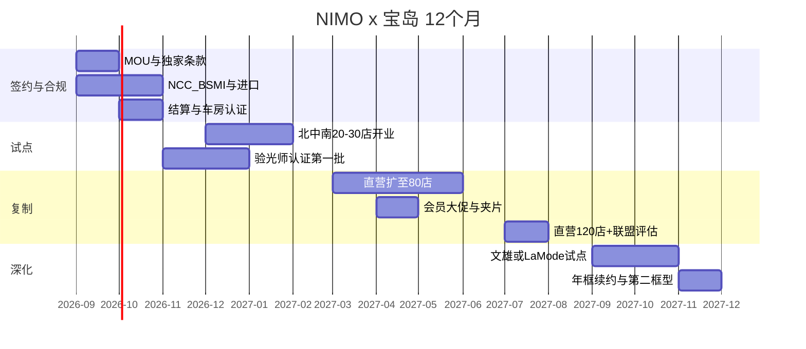

# NIMO × 台湾宝岛眼镜 KA 合作计划

**对象：** 宝岛光学科技股份有限公司（5312.TW）及其集团品牌（宝岛直营 / 策略联盟 / 文雄 / 镜匠 / La Mode / SOLOMAX / 米兰）  
**产品：** NIMO 日戴 HUD 智能眼镜（处方套装）  
**密级：** 商务谈判用 · 草案  
**日期：** 2026 年 8 月

---

## 1. 为什么是宝岛，为什么是现在

### 1.1 合作一句话

> 请宝岛把 NIMO 做成「下一副日常眼镜」，而不是再引进一款 3C 智能眼镜。Rokid 负责「全功能 AI 体验」，NIMO 负责「全天可戴的处方 HUD」。两者可以在同一集团货盘共存，但必须分层。

### 1.2 宝岛的战略价值（对 NIMO）

| 资产 | 公开事实（约） | 对 NIMO 的转化 |
| --- | --- | --- |
| 店网 | 集团约 470 店（2024 年底）；直营约 347；宝岛直营 226 + 联盟 123 | 足够做全国样板，又不必一次铺完 |
| 地位 | 台湾连锁眼镜集团第一（店数）；全台眼镜店约 4,000，连锁约 29%，宝岛集团约 11% | 行业标杆效应 > 绝对市占 |
| 会员 | 约 400 万 | 精准触达「本来就要换镜」的人 |
| 专业 | 门市 2–3 名国家认证验光人员；依视路/蔡司设备；眼科分院 | 波导成像必须靠验配，这是 3C 做不了的 |
| 财务 | 2024 营收约 NT$40.2 亿；2025 约 NT$41.9 亿（+4.3%）；毛利率传统眼镜零售高位 | 需要的是新客单与年轻化，不是再堆低价框 |
| 转型 | 二代店体验化、商场店、APP、眼科一站式；2025.12 已卖 Rokid | 内部已有「智能眼镜」预算科目与 51 店试点经验 |
| 法规 | 《验光人员法》落日条款强化持证验光所 | 合法验配能力成为智能镜准入壁垒，宝岛是受益者 |

集团品牌角色（用于后期扩品，不在一期合同强塞）：

| 品牌 | 店数量级 | 客群 | NIMO 用法 |
| --- | --- | --- | --- |
| 宝岛直营 | 226 | 上班族、家庭、专业配镜 | **一期主战场** |
| 宝岛策略联盟 | 123 | 类直营、管理半径较长 | 二期，认证后开放 |
| 文雄 | 65 | 学生、年轻、组合价 | 二期「校园通勤款」活动 |
| 镜匠 | 26 | 年轻价格带 | 观察 |
| La Mode | 16 | 时尚太阳镜 | 夹片/时尚框联名 |
| SOLOMAX | 10 | 商场快时尚 | 商场体验桩 |
| 米兰 | 4 | 精品 | 不做低价，可做 VIP 预览 |

### 1.3 市场窗口（台湾）

1. **需求侧：** 台湾近视高发、换镜周期短；光波导对瞳距/度数/眼位敏感，媒体与宝岛自身已向公众教育「AI 眼镜不是买了就能戴」。
2. **竞争侧：**
   - 宝岛 × Rokid：2025/12/13 开卖，指定 **51 店**，原价 NT$24,999、宝岛价 **NT$19,999**，有摄有语音，全功能叙事。
   - 灿坤 × 蔡司 × 小林：3C+光学店中店，「EyeCare 生态圈」，卖 Rokid / 华硕等，Rokid 活动价可到 NT$19,999。
   - Even G2：2026/8 由创家代理，**NT$19,990**，无摄 HUD，但走全国电子、法雅客、诚品、台湾大哥大、momo——**光学专业渠道仍空心**。
3. **NIMO 空隙：** 无摄像头 + 约 29g + 含处方的万元级（建议 **NT$12,980–14,980**）+ **只把处方权给光学 KA**。这正好是宝岛可以对外说「专业验配独有」的货，而 Even 把处方能力让给了 3C。

### 1.4 宝岛为什么可能点头（对方动机）

| 宝岛的课题 | NIMO 给的答案 |
| --- | --- |
| Rokid 客单高、讲解重、日戴率未知，难成换镜主力 | NIMO 走换镜决策，客单接近中高端配镜 |
| 3C（灿坤+小林）在抢「AI 眼镜+配镜」故事 | 把「处方 HUD」独家留在视光连锁，反击 3C |
| Even 在 3C 卖无摄 HUD，光学店缺同族商品 | 宝岛可宣称「专业版日戴镜在眼镜店」 |
| 会员要新理由回店 | 「下一副眼镜可以更聪明」比「再买一副框」强 |
| 验光师产能在法规后更值钱 | 把高专业服务卖进智能镜，而不是只卖镜片升级 |
| 毛利顾虑（智能镜常不如传统配镜） | 见第 5 节：把单副门店毛利做到 **NT$3,500–6,000** |

---

## 2. 合作定位与品类隔离

### 2.1 货盘分层（建议写进合同附件）

| 层 | 品牌 | 消费者一句话 | 店员话术 |
| --- | --- | --- | --- |
| 日戴处方 HUD | **NIMO（独家 18 个月）** | 像普通眼镜，能看导航/翻译/提词 | 「您本来就要换镜，要不要让它聪明一点？」 |
| 全功能 AI 镜 | Rokid（已有） | 能拍、能问、能听 | 「想要相机和语音助手，看这款」 |
| 传统功能镜 | 宝岛原有框片 | 视力矫正与时尚 | 主业不变 |

**独家范围（谈判底线）：**  
在宝岛集团（含直营与一期试点品牌）内，**无摄像头、以 HUD 信息提示为主的智能眼镜**，18 个月独家。不要求退出 Rokid，不限制太阳镜/隐眼/助听器。

**对 NIMO 的对等承诺：**  
台湾处方套装 **不进入灿坤、全国电子、台湾大哥大、momo 作为可配镜 SKU**；3C 若做展示，只发「宝岛验配券」。这是换取宝岛全力主推的关键对价。

### 2.2 目标客群（门店可执行）

优先：25–45 岁、已有配镜史、客单 NT$8,000 以上、通勤/商务、在意隐私（金融、科技、教育、医疗、公务员）。  
不优先：儿童近视控制（法规与伦理）、只买隐眼的客、纯价格敏感组合价客（可转到文雄二期）。

---

## 3. 12 个月目标（谈判用三档）

以 **售出并激活** 计，不含演示机。

| 档 | 店数节奏 | 12 个月激活 | 约合零售额（按 NT$13,980） | 适用条件 |
| --- | --- | --- | --- | --- |
| 保守 | 20 店×4 月 → 50 店×8 月 | 4,000 | ~0.56 亿 | 只试点、培训未铺开 |
| **基准** | 30 店×3 月 → 80 店×5 月 → 120 店×4 月 | **8,000–12,000** | **1.1–1.7 亿** | 独家+毛利+联合会员 |
| 冲刺 | 同上 + 文雄 20 店 + 商场活动 | 15,000 | ~2.1 亿 | 需加框型与夹片、加大 MDF |

单店产能假设（基准）：成熟店月均 **8–12 副**（旗舰 15–25，社区 4–8）。  
对宝岛 2025 年约 42 亿营收而言，基准档贡献约 **2.6–4.0%** 零售额，足够成为「新增长故事」，又不会扰乱主业。

---

## 4. 落地节奏

### 第一期（签约后 0–90 天）：样板，不铺量

**选店 20–30 家，建议结构：**

- 台北市 / 新北：12–15（信义、内湖科学园、南港、板桥、西门商圈各至少 1）
- 新竹 / 桃园：3–4（科学园通勤客）
- 台中：3–4
- 台南 / 高雄：3–4
- 其中至少 5 家为商场/百货店型，至少 2 家邻近宝岛眼科

选店标准：二代店或体验面积足够、验光师稳定、周配镜量位于该区前 30%、店长愿意上认证课。  
**不要沿用 Rokid 的 51 店原名单全盘复制**——全功能 AI 镜与日戴镜的客流结构不同；可重叠 30–40% 旗舰，其余按「换镜量」重选。

90 天试点 KPI：试戴→成交 ≥ 15%；成交→激活 ≥ 90%；店员认证 100%；单店周试戴 ≥ 12。不达标店 30 天辅导，仍不达标换店。

### 第二期（90–180 天）：直营复制到 80

- 培训师巡回：北中南各 1 名
- 车房 TAT：标准片 3–5 工作日，加急 48 小时（科学园店）
- 第一次会员活动：宝岛 APP「换镜季 + HUD」

### 第三期（180–365 天）：120 直营 + 联盟评估 + 侧翼品牌

- 策略联盟店：只有通过认证、接受演示机押金与价格体系者才供货
- 文雄：学生通勤包（学期初），严控折扣以免冲击宝岛主价
- 续约谈判：用 D30 佩戴数据而不是进货量

---

## 5. 商务条款框架（谈判草案）

以下数字为 **开价/底线示意**，正式以双方法务与财务为准。汇率工作假设：人民币 2,499 ≈ 新台币 1.1 万量级，零售建议锚定 **NT$13,980**（含标准折射率处方片）。

### 5.1 供货与价格

| 项目 | 建议 |
| --- | --- |
| 对消费者零售 | NT$13,980（标准 Rx Pack）；升级片另计 |
| 对宝岛供货（主机+标准片结算包） | 零售的 **62–68%**（即门店毛利率约 32–38%） |
| 升级功能片 | 走宝岛现有镜片加价体系，NIMO 收认证片成本 |
| 夹片 | 零售 NT$1,980–2,980，毛利率 ≥ 40% 给门店 |
| 演示机 | 每店 6 副，押金或额度；每季盘点；损耗超 5% 门店承担 |
| 账期 | 月结 30–45 天 |
| 铺底 | 旗舰 8 副、标准店 4 副，售出补货，**不买断压货** |
| 价格保护 | 合同期内不在台湾官方渠道降价；若降价，30 天库存补差 |

### 5.2 门店单副经济（示意，NT$）

|  | 金额 |
| --- | --- |
| 顾客支付（标准包） | 13,980 |
| 宝岛进货（取中值 65%） | 9,087 |
| **主机包毛利** | **4,893** |
| 升级片（假设 30% 顾客加购均 2,000，毛利 50%） | 期望 +300 |
| 校准服务（可内含） | 0–500 |
| **期望门店毛利** | **约 5,200** |

对比：一副传统中端配镜毛利常见数千元台币；NIMO 必须落在同一量级，店员才愿意从「卖蔡司片」里拿出 15 分钟。  
对比 Rokid NT$19,999：绝对毛利可能更高，但讲解时间长、退货与差评风险高、日戴转化未知。店长话术应是「NIMO 更好成交、更好复购」。

### 5.3 市场基金（MDF）与激励

| 项目 | 建议 |
| --- | --- |
| MDF | 净进货额的 **5–8%**，用于陈列、DM、APP 推播、开业 |
| 开业支持 | 每试点店陈列包 + 培训 + 开业 14 天品牌驻店 |
| 店员激励 | 激活一台 NT$300–500；D30 仍在用再奖 NT$200（防只开单） |
| 店长 KPI | 纳入季度奖金，权重建议 10–15% |
| 联合广告 | 开业季 NT$300–500 万量级（可 MDF 抵），宝岛出会员资源 |

### 5.4 对等义务

**宝岛：** 品类独家；指定店陈列达标；验光师认证；APP 与 DM 露出；不把 NIMO 当 Rokid 的附赠；价格不私自破价。

**NIMO：** 处方不进台湾 3C 履约；7 日良品替换；固件繁中与 LINE；驻台售后窗口；每季向宝岛总部经营会议提交激活与 D30 数据；不挖宝岛会员做品牌私域（可做产品社群，但获客归门店）。

### 5.5 法律与合规

- 无线：NCC；电器安全：BSMI；电池运输：UN38.3
- 不宣称医疗器械疗效；视力矫正效果归镜片与验配，HUD 为信息显示
- 无摄像头作为广告主句，需可被验证（拆机图仅官方提供）
- 个资：验光数据留在宝岛系统；NIMO App 仅处理通知与显示偏好，隐私政策出繁中版
- 定制镜片适用台湾消费者保护对客制商品的合理例外，需在购机同意书写明

---

## 6. 零售运营手册（摘要）

### 6.1 店内动线（8 分钟体验 + 标准验配）

1. **识别（30 秒）：** 换镜客、商务着装、抱怨「眼镜只能看不能用」→ 引导日戴桌，不先讲芯片。
2. **试戴平光演示（3 分钟）：** 抬头看导航/翻译字幕；强调无摄、会议室可戴。
3. **决策分岔：** 要相机与语音 → Rokid；要全天戴、像普通眼镜 → NIMO。
4. **验光与参数（按宝岛现有流程）：** 额外记录瞳距、瞳高、顶点距、前倾角、包裹角。
5. **选框与片：** 标准包默认；高度数走高折；户外客推变色/夹片。
6. **取件校准（5 分钟）：** 工装对位、亮度、App 绑定、通知白名单。
7. **3 日 LINE 回访：** 佩戴压痕、显示是否居中、通勤是否使用。

### 6.2 陈列规范

- 位置：验光区可见，不进隐眼墙，不进儿童区
- 桌面：1 头模、6 试戴、1 夹片、1 iPad 循环 30 秒片、价签写「含标准处方镜片」
- 禁止：与 VR 头显、游戏机、手机同桌（即使商场店）

### 6.3 培训认证

| 课程 | 时长 | 对象 | 过关 |
| --- | --- | --- | --- |
| 产品与话术 | 2h | 全员 | 笔试 |
| 验配参数与禁忌 | 2h | 验光师 | 实操 1 例 |
| App 与售后 | 1h | 店长/副店 | 工单演练 |
| 季度复训 | 1h | 认证人员 | 神秘客 |

未认证门店不得开处方单。品牌发放「NIMO 认证验配」胸章，用于顾客信任。

### 6.4 售后 SLA

| 问题 | 责任 | SLA |
| --- | --- | --- |
| 死机、充电、连接 | NIMO | 7 日良品换 |
| 波导/显示暗点 | NIMO | 14 日 |
| 度数不准、装配 | 门店车房 | 5 工作日重做 |
| 镜架变形（非质量） | 视保修条款 | 付费修 |
| App 账号 | NIMO 在线 | 24h |

消费者只加一个官方 LINE；后台按序列号分流。

---

## 7. 联合营销 12 个月日历

| 月份 | 主题 | 动作 |
| --- | --- | --- |
| 开业月 | 「下一副眼镜，聪明一点」 | 总部记者会（视光+科技媒体，不走纯 3C 发布会）；51 店级旗舰不强调对打 Rokid |
| +1 | 商务通勤 | 内湖/竹科店延长营业；企业预约验配夜 |
| +2 | 隐私与职场 | 无摄白皮书；金融/教育定向 |
| +3 | 会员换镜季 | APP 券：升级片折扣，不直接砍主机价 |
| +4 | 户外 | 夹片上市；偏光加购 |
| +6 | 毕业/就业 | 文雄侧翼或宝岛年轻客群 |
| +9 | 新框型 | 第二框；La Mode 时尚预览 |
| +12 | 周年 | 用 D30 用户故事，而不是出货战报 |

传播禁令：不攻击 Rokid；不承诺治疗近视；不演示偷拍（本就无摄，仍禁止「监控」联想）。

---

## 8. 组织与治理

### 8.1 联合治理

- **月度经营会：** 宝岛商品/教育/资讯 × NIMO 台湾 GM/KA/培训
- **看板：** 试戴、成交、激活、D30、重做率、NPS、缺货
- **升级：** 连续两周激活低于计划 30%，启动联合督导小组

### 8.2 NIMO 台湾最小班子（对应全球计划）

| 岗位 | 人数 | 画像 |
| --- | --- | --- |
| 台湾总经理 | 1 | 眼镜或高端零售 KA 出身 |
| KA 经理（宝岛总部） | 1 | 认人、认流程、认陈列 |
| 验配培训师 | 2 | 持证验光背景 |
| 门店运营/神秘客 | 1 | 北中南巡 |
| 售后与仓储 | 1–2 | 电子+物流 |
| 市场（兼 LINE/内容） | 1 | 繁中内容 |

仓储建议：北北基一处保税/完税仓，演示机与良品换货与门店补货同仓。

---

## 9. 竞争应对剧本

| 情景 | 动作 |
| --- | --- |
| 宝岛要求 NIMO 与 Rokid 二选一 | 拒绝。用分层货盘保护对方已投入的 51 店；强调客群与日戴差异 |
| 宝岛要求价格对齐 Even（约 2 万） | 拒绝涨到 2 万。NIMO 的武器就是「换镜可及」；可做限量材质款拉高，不改标准包 |
| 灿坤/小林来谈处方 | 台湾处方权已承诺宝岛，转介平光展示+验配券 |
| Even 也来谈宝岛 | 合同独家挡住 18 个月；期间把 SOP 做成宝岛内部教材，提高切换成本 |
| 店员仍只推传统高毛利片 | 把升级片毛利叠在 NIMO 上；店员奖与 D30 绑定；店长 KPI |
| 高度数超出 800 | 明确禁忌，转传统镜，不冒险损坏波导口碑 |
| 媒体评测对比 Rokid | 提供「日戴 7 天」样机与验配，不提供参数对打表 |

---

## 10. 谈判议程（建议 3 次会）

**第一次（60 分钟，商品+副总）：** 品类分层、独家范围、3C 对等承诺、试点店逻辑。不谈死价。  
**第二次（90 分钟，商品+财务+教育）：** 供货价、毛利表、MDF、培训、售后 SLA。  
**第三次（签约）：** 20–30 店名单、开业日、记者会分工、数据接口。

开场材料只带三页：① 台湾货盘空隙图（Rokid / Even / NIMO）；② 单店毛利表；③ 8 分钟验配 SOP。不要带全球元宇宙愿景。

---

## 11. 成功标准与退出

**12 个月成功（同时满足）：**

1. 激活 ≥ 8,000（基准档下限）
2. 认证店 ≥ 80
3. D30 周活 ≥ 40%
4. 处方重做率 ≤ 8%
5. 宝岛同意续约并扩联盟店

**退出/收缩：** 若 90 天试点激活 < 400 且试戴成交 < 8%，则缩到 10 家旗舰做品牌橱窗，不指责渠道，先查培训、供货、软件繁中与价格。

---

## 12. 附录：对宝岛提案的「对方页」摘要（可直接贴进简报）

1. 智能眼镜在台湾已经不是新名词；缺的是 **能进验光流程、能全天戴、能让会员换镜时顺手升级** 的产品。  
2. NIMO 无摄像头、约 29 克、含标准处方、建议售价约 NT$13,980，对准宝岛主客群，而不是 3C 尝鲜客。  
3. 请宝岛担任台湾 **处方日戴 HUD 独家光学 KA**；NIMO 承诺处方不进 3C 履约。  
4. 门店毛利按一副中高端配镜设计；店员按激活与 30 日使用计奖。  
5. 先 20–30 家样板，再复制到 80–120 家直营；用数据决定要不要进联盟与文雄。  
6. Rokid 继续卖给「要相机与语音」的人；NIMO 卖给「要下一副眼镜」的人。
