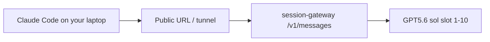

# Session Gateway — GPT5.6 sol pool (Option B)

Product-style gateway in front of a **10-slot hot pool** of Cloud Agents named **GPT5.6 sol**, model `gpt-5.6-sol` with `reasoning=xhigh`.

Workers must be created via Cloud Agents API (`npm run hot-start -- --force`). Task/cloud subagents from an orchestrator chat are **not** API-runnable (legacy workflow).

Orchestrator (this instance):  
https://cursor.com/agents/bc-4c8e891e-d046-4919-a55a-eafe1e62dcea

## What it enforces

1. **Remote invoke via gateway** — clients never pick a raw worker URL themselves for production traffic.
2. **One session → one worker** — lease is exclusive; a second acquire for the same `clientId` is rejected.
3. **Disconnect ⇒ hard reset** — heartbeat TTL expiry (or explicit release) archives/deletes the old agent and creates a fresh worker in that slot.
4. **Precise billing + full retention** — every turn stores user/assistant/thinking/tool events (sha256) and settles tokens via `GET /v1/agents/{id}/usage`.

## Quick start

```bash
cd session-gateway
cp .env.example .env
# set CURSOR_API_KEY (Dashboard → API Keys) and GATEWAY_API_KEY
npm install
npm run hot-start    # create/fill 10 workers
npm start            # listen on :8787
```

## Client flow

```bash
# 1) acquire
curl -s localhost:8787/v1/session/acquire \
  -H "x-api-key: $GATEWAY_API_KEY" \
  -H 'content-type: application/json' \
  -d '{"clientId":"client-A"}'

# 2) heartbeat every ~15s (TTL default 45s)
curl -s localhost:8787/v1/session/$SESSION_ID/heartbeat \
  -H "x-api-key: $GATEWAY_API_KEY" -X POST

# 3) chat (streams thinking server-side into data/)
curl -s localhost:8787/v1/session/$SESSION_ID/chat \
  -H "x-api-key: $GATEWAY_API_KEY" \
  -H 'content-type: application/json' \
  -d '{"message":"你好，介绍一下你自己"}'

# 4) release → hard reset worker
curl -s localhost:8787/v1/session/$SESSION_ID/release \
  -H "x-api-key: $GATEWAY_API_KEY" \
  -H 'content-type: application/json' \
  -d '{"reason":"client_done"}'
```

## Data layout

| Path | Purpose |
|---|---|
| `data/pool-registry.json` | slot → bcId/url registry |
| `data/gateway.db.json` | leases, turns, billing |
| `data/transcripts/<session>/<turn>/` | full artifact JSON |
| `data/thinking/<session>.ndjson` | append-only reasoning stream |

## Claude Code reverse proxy

Claude Code speaks Anthropic `POST /v1/messages`. This gateway exposes a compatible facade that leases one GPT5.6 sol worker and forwards the latest user turn.



### 1) Expose the gateway to your laptop

Gateway currently listens on the cloud VM `:8787`. On a machine that can reach it (or the same host), publish a public HTTPS URL, for example:

```bash
# example: cloudflared / ngrok pointing at localhost:8787
cloudflared tunnel --url http://localhost:8787
```

### 2) Point Claude Code at the gateway

In `~/.claude/settings.json` (or a project `.claude/settings.json`):

```json
{
  "env": {
    "ANTHROPIC_BASE_URL": "https://YOUR-TUNNEL-HOST",
    "ANTHROPIC_AUTH_TOKEN": "dev-gateway-key",
    "ANTHROPIC_API_KEY": "",
    "ANTHROPIC_DEFAULT_SONNET_MODEL": "gpt-5.6-sol",
    "ANTHROPIC_DEFAULT_OPUS_MODEL": "gpt-5.6-sol",
    "ANTHROPIC_DEFAULT_HAIKU_MODEL": "gpt-5.6-sol"
  }
}
```

Notes:
- `ANTHROPIC_BASE_URL` 不要带 `/v1`（Claude Code 会自己拼 `/v1/messages`）。
- 自定义网关用 `ANTHROPIC_AUTH_TOKEN`（Bearer），并把 `ANTHROPIC_API_KEY` 置空。
- 指定槽位：把 model 设成 `gpt-5.6-sol-03`，或请求头 `x-worker-slot: 3`。
- 同一 Claude Code 进程会粘绑定同一个 worker（按 token+UA 派生 clientId）。

### 3) Capability boundary（重要）

| 能力 | 是否支持 |
|---|---|
| 用 Claude Code 当客户端，把问答转到 GPT5.6 sol | 支持（文本） |
| Claude Code 本地工具循环（Edit/Bash 等 tool_use）由 Sol 驱动 | **不支持**（协议不同：Sol 是远端 Cloud Agent 工具，不是 Anthropic tool_use） |
| 精准会话计费 / transcript | Gateway 侧支持 |

若你要的是「Claude Code 本地改代码」，Sol 不适合当完整后端；若你要的是「Claude Code 里连到指定 Sol 槽位做远程会话」，用本反代即可。

## Register Task-bootstrapped workers

If workers were created from the orchestrator via Cursor Task(cloud) before `CURSOR_API_KEY` was available:

```bash
npx tsx scripts/register-task-workers.ts workers.json
```

## Notes

- Cursor Agent URLs require auth + repo access; the gateway is the external integration surface.
- Usage API is **token-precise**. USD estimates use optional `USD_PER_MILLION_*` env knobs until you map your plan rates.
- Hard reset is intentional: product cloud agents resume by default; this gateway opts into disposable sessions.
- API-native workers are required for `/v1/messages`. Task/legacy cloud subagents cannot accept Cloud Agents API runs.
